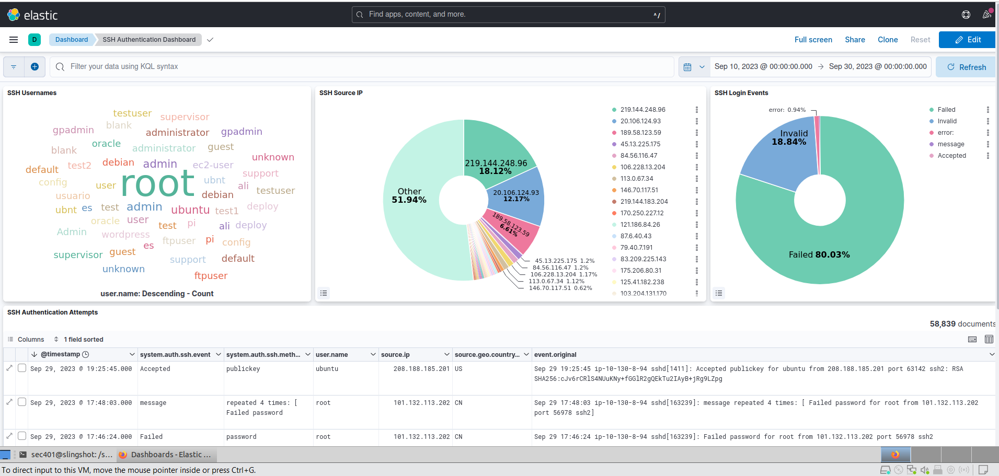
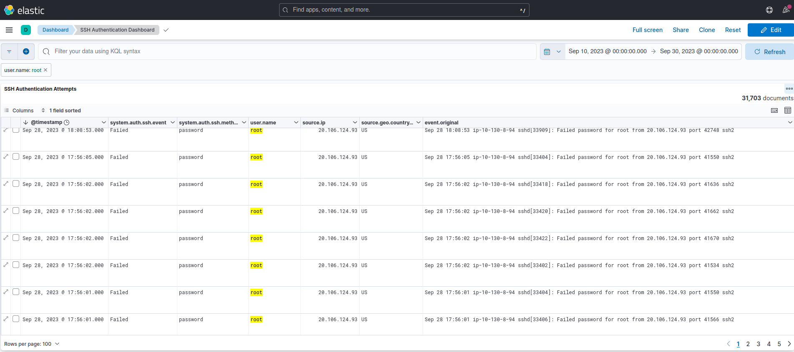
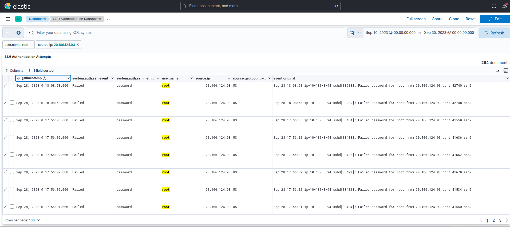
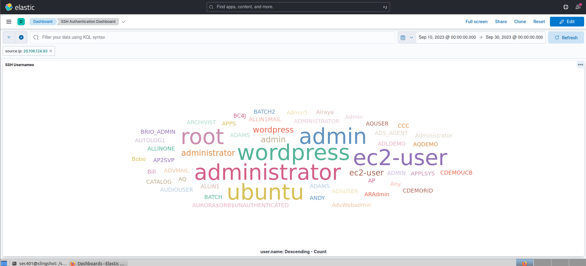
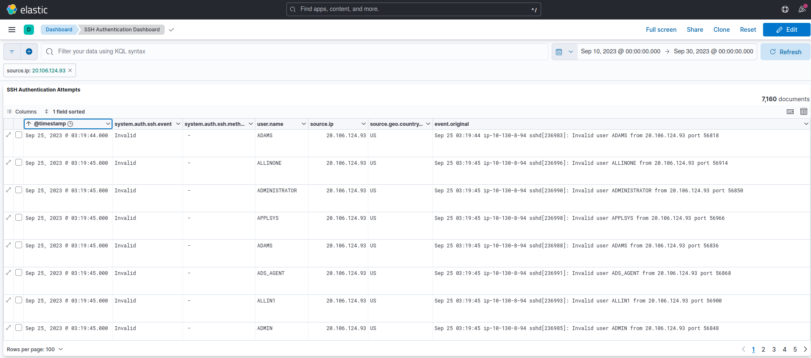

# Lab-3.4-SIEM-Log-Analysis

## Overview:

To continue my investigation into the compromised web server, I leveraged the use of Alpha.Inc’s  SIEM (Security Information and Event Management) platform, the Elastic Stack. 

SIEM’s are an essential tool in a security operations center. They centralize, consolidate, analyze, and correlate massive amounts of log data into actionable alerts. They allow the analyst to detect, investigate, and respond to threats that would normally go undetected in the noise of raw data. 

## 1: Analyzing the Dashboard

The web server had SSH directly open to the internet (not good). I navigated to the SSH Authentication dashboard in Elastic. Just from first inspection, I saw 80% of login attempts failed, around 30% of source IP’s were from two IPs, and the most used username was “root” from Sept 10, 2023 to Sept 30, 2023.

## 2: Investigating “root”

I filtered for SSH logins with the username “root”. The default superuser in Linux is “root” and has unrestricted access to files, commands, and system resources. I saw failed login attempts, multiple times per second, from the attacker’s IP 20.106.124.93. This activity correlates to a password guessing attack. 

## 3: Timeframe

I applied another filter for the attacker’s IP , then sorted the timestamp’s to determine the time period over which these attempts occurred. Excluding the 3 oldest and 2 newest, the other 289 attempts were on Sept 28, between 17:53:27 and 17:56:05 – about a 2.5 minute timeframe. 

## 4: Investigating the Attacker’s IP

I cleared the filter for the username “root”, to see if any other logins tied to the attacker used different usernames. Looking at the SSH username “tag could” visualization,  the attacker tired many usernames; mostly generic usernames that could have elevated privileges like “rootadmin” or “administrator” etc. 

## 5: Password Spraying Attack

I dove into the data table panel and sorted the attacker’s login attempts from oldest to newest. I immediately saw multiple failed logins, multiple per second, with many different usernames. This, along with the “invalid user” message, correlated to a password spraying attack. 

## Takeaways:

This lab highlighted the importance of centralized logging and using SIEM’s to detect suspicious activity, like brute-force attacks, before attackers gain unauthorized access. Relating back to the password audit earlier in the investigation, this lab reinforced how weak passwords, exposed remote services, and inadequate monitoring can increase organizational risk. Through, log analysis and visualizations, this lab showed how security analysts can identify indicators of attack/compromise, improve incident response plans, and implement stronger defense-in-depth measures, such as password/account lockout policies, MFA, and SSH hardening. 

